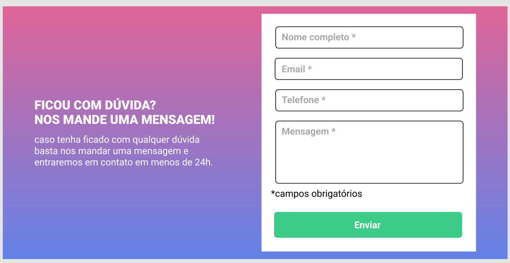
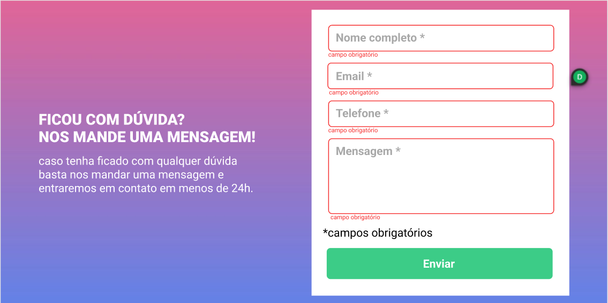
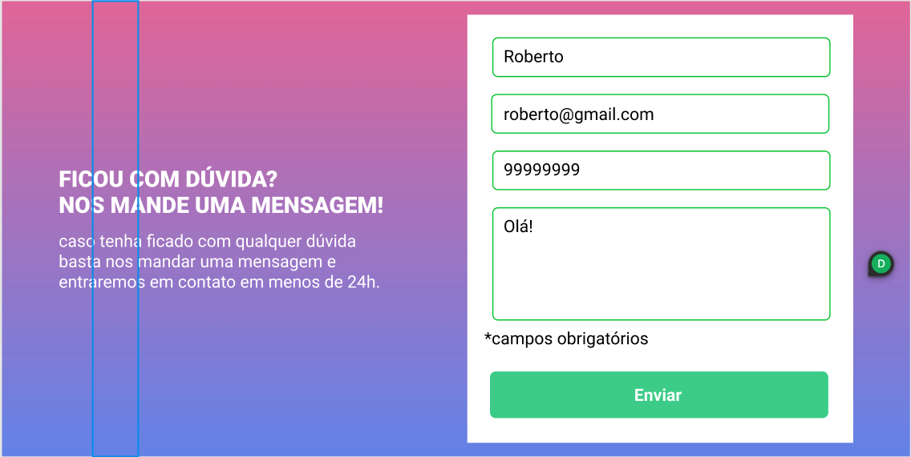
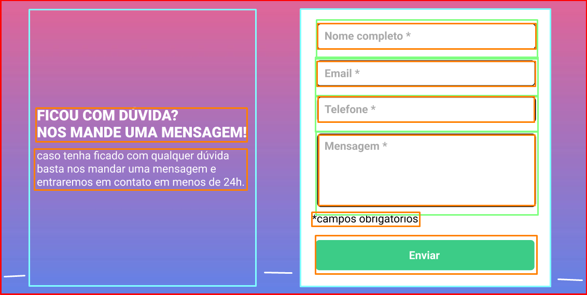

# Project Form
# PT-BR

Esse é um desafio proposto pelos gêmeos, Cadu e Beto, como uma quest do curso Dev em Dobro, com o objetivo de criar um página de formulário com validação feito por JavaScript

## tabela de conteúdos:

- [Visão geral](#visão-geral)
    - [O desafio](#o-desafio)
    - [Designs](#designs)
- [Meu processo](#meu-processo)
    - [Processo utilizado](#processo-utilizado)
    - [O que eu aprendi](#o-que-eu-aprendi)
    - [Dificuldades](#minhas-dificuldades)
- [Autor](#autor)

## Visão geral
### O desafio:
O desafio conciste na criação de uma página de formulário:
- A validação deve ser feita com JavaScprit.

### Designs:
Versão desktop:

Versão desktop erro:

Versão desktop confirm:

## Meu Processo
### Processo utilizado:
1. Análise do projeto e design
    - Analisei o design do projeto para poder estudar onde colocar cada elemento e para ver quais elementos iria precisar.
    
2. Criação da base do projeto
    - Criar a estrutura de pastas e diretórios do projeto.
3. Começando a codar
    - Criei a estrutura base do HTML que iria usar e criei o reset.css.
4. HTML
    - Começei criando pelo HTML com um main onde ficaria o conteudo, uma div para o texto e outra para o formulário.
5. CSS
    - Estilizei o projeto pelo CSS indo ajustando o projeto para ter o design pedido.
6. Analise JS e ajustes
    - Fiz uma analise rapida de qual seria a melhor maneira para validação, e fiz os ajuster no HTML e CSS que iria precisar.
7. Codando JS
    - Após analiser começei a criar o JS conforme eu tinha pensado que funcionaria.
8. Refatoração e ajustes
    - Fiz uma refatoração no código com alguns ajustes finais para melhor funcionamento.
9. Responsive
    - Com o projeto pronto para desktop, fiz os ajustes para funcionar responsivo.

### O que eu aprendi?

- Aprendi sobre como e importante ter um código com separação de funções 
- Aprendi que nem sempre e preciso começar com o código bem estruturado.

### Minhas dificuldades:

- Tive dificuldade na hora de mostrar o erro para email errado.
    - .

- Tive dificuldade para permitir apenas digito no input de celular.
    - .

## Autor

- Frontend Mentor - [@GFeltran](https://www.frontendmentor.io/profile/GFeltran)
- ~~Portfólio - [Feltran]()~~
- ~~Twitter - [@Feltran]()~~
